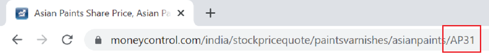

# Moneycontrol Data Scraper

*The project is still in development phase*

A python module that helps you retrieve financial data of public Indian companies listed on the National Stock Exchange and the Bombay Stock Exchange from the popular website [Moneycontrol](https://www.moneycontrol.com/)</br>
*This is not an official Moneycontrol python library or api*

Currently you can retrieve following data
1. Small summary about the business of the company
2. Basic data about the company like Share Price, Market Cap, PE etc.
___
### Quick Start
Clone this repo and write your own scripts in your local repo
###### comp
The comp is the main class of mc module. Data of any entity can be retrieved using this class.</br>
The comp class accepts one argument. The *symbol* of the company,index,etf etc. The symbol of any entity can be found in its url on moneycontrol.<br><br>
<br>Symbol of Reliance Industries Ltd. is RI

Symbol of Asian Paints is AP31


<br>

```python
import mcontrol as mc


#the comp module will return all the data about the company
#the comp module accepts the company symbol as argument

ril = mc.comp('RI')

# about the company
print(ril.about)

# a dictionary listing basic details like closing price, market cap, pe etc
print(ril.info)
```
</br>Output of above program will be


___

### Requirements
lxml</br>
beautifulsoup4
